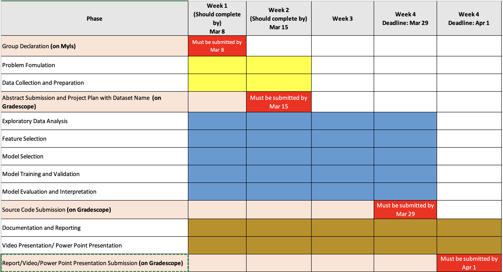

# Course Project
*Author*\
Dr. Sukhjit Singh Sehra

**CP322: Course Project – Winter 2026**

**Due: Wednesday, April 01, 2026 (Before 11:59 PM)**

## Part 1: Project Instructions
This project is almost certain to involve you asking me many questions about things we did in class. So, do not leave everything to the last minute. The goal of this project is for you to use the methods described in this course (machine/deep learning models) to analyze data. I expect you to demonstrate an understanding of the methods we have covered, their applicability to specific problems, possible pitfalls, and creative methods of combining them to identify data patterns.

You are most welcome to bring a dataset from the application area of your interest, or you can also select any data set described in Part II. You work in a group with a maximum group size of 2 (you can choose to work independently if you prefer). These instructions are intended to give you some idea of what I expect you to do and report.

I expect you only to hand in a catalog of what you tried, and your work will be monitored via your activity on GitHub Repo. Here are some of the steps to build the machine/deep learning models:

1. Choose a dataset: The first step is to choose a dataset for your project. You can either use a public dataset or collect your data from the domain of your interest. Ensure the dataset has enough data points to train and test your model.

2. Data preprocessing: Once you have your dataset, you need to preprocess it to make it suitable for machine learning. This includes cleaning the data, handling missing values, encoding categorical variables, and scaling numerical features. This step is crucial as the accuracy of your model will depend on the quality of your data. Some issues to consider to be included:

    1. Are there missing values in your data? Is there any pattern in whether or not a particular value is missing? How will the missing values be dealt with?
    2. Are there problems because of data size (rows or columns)? Are some algorithms more affected? Can you come up with any solutions?
    3. If you are doing any clustering, are there clusters in the data? How many? How well separated are they? Do different methods agree on the number of clusters?
    4. Is scaling of the variables an issue? For what methods?
    5. Are there outliers in the data? How did you deal with them? (g). Does transforming the data simplify any analysis?
    6. Are there relationships between the variables?
    7. Are you doing any feature engineering to select the most important parameters (optional)

3. Split the data: After preprocessing, you need to split your data into training and testing sets. The training set will be used to train the model, while the testing set will be used to evaluate the model’s performance.

4. Choose a model: Now, it’s time to choose the model you want to use for your project. Depending on the nature of your data and response variable, you can choose from a wide range of models, such as linear regression, logistic regression, decision trees, random forests, neural networks, etc. Make sure that you pick at least 2 – 3 models to fit and compare their performance.

5. Train the model: With your chosen model, you can train it on the training set. This step involves fitting the model to the training data, where the model learns to identify patterns and relationships in the data. Experiment with different hyperparameters, such as learning rate, number of hidden layers, etc., to find the best configuration for your model.

6. Evaluate the model: After training the model, you need to evaluate its performance on the testing set. This step involves calculating various performance metrics, such as accuracy, precision, recall, F1-score, etc., to see how well the models are doing. Don’t overfit your model to the training set. Overfitting occurs when the model is too complex and fits the noise in the training data. This can lead to poor performance on new, unseen data. Use regularization techniques, such as dropout or L1/L2 regularization, to avoid overfitting. You can also use techniques such as cross-validation to evaluate the model’s performance on different subsets of the data and ensure that it generalizes well to new data.

    Perform hyperparameter tuning to optimize the performance of your model. This involves adjusting the hyperparameters of your model, such as learning rate, number of hidden layers, etc., to find the best configuration for your model. You can use techniques such as grid search or random search to find the optimal hyperparameters for your model.

7. Compare models: This step involves evaluating the multiple fitted models, comparing their performance on the same testing set, and choosing the best model.

8. Communicate the results: Finally, you need to communicate your results via reports. You can create visualizations, such as plots and tables, to show the performance of different models. You should also explain your findings, highlighting the strengths and weaknesses of different models and suggesting how they can be improved.

To keep track of the ML modeling building approach, we will be using GitHub Classroom. To submit a group assignment project on GitHub Classroom, follow these steps:

- Create a Group on Myls (by March 8th): First, you need to create a group on Myls for your project. You can do this by going to the course page on Myls and selecting the “Groups” tab. Click on “Create Group” and follow the instructions to create a group for your project. Remember your group #.

- Make sure that each member of the group has a GitHub account.

- Use the link https://classroom.github.com/a/hlUG2xa0 to access the assignment.

- Once you have accessed the assignment, you will see a green button that says, “Accept this assignment.” Click on the button to create a repository for your group. Carefully select your name.

- Next, you will be prompted to choose a team for your group. If your team already exists, select it. Otherwise, click the “Create a new team” button to create a new team for your group. Include your teammate in the new team (only one of you will be creating the team). The name of the team must be your and your groupmates’s group# e.g., “Group_X” (that you created in Myls). **Only one of you will create a team (named as mentioned), and the other will join it.** *Caution: Do not create a random name of your team.*

- After creating the repository (by default, Private and keep it as is), each group member must clone it to their local machine using Git. To do this, navigate to the repository’s page and click the green “Code” button. Copy the HTTPS link and use it to clone the repository. You can use GitHub Desktop on your local OS to manage the GitHub repository better.

- Work together to complete the assignment, ensuring everyone contributes and regularly pushing your work onto GitHub. Your contributions and division of the work will be graded based on the repo activities. If your GitHub account is missing from the commits/contributions list, you will get zero for the assignment.

- Keep pushing your changes daily to GitHub so I can check your progress. Once the assignment is complete, push the changes to the repository using Git.

- When you are ready to submit the project, navigate to the assignment page on Gradescope and click the “Submit assignment” button. This will prompt you to select the repository that you want to submit. Select the repository that your group created.

- Now, confirm that you want to submit the assignment. You will be asked to provide a comment explaining your submission. Provide relevant details and click on the “Submit assignment” button.

- In the final step, visit Gradescope and select the project assignment. It will ask you to connect your GitHub Account. Once authorized, you can select the repository you were working with and select the branch master to submit on Gradescope. Do not forget to add your assignment partner to the Gradescope Assignment.

- That’s it! Your group assignment has now been submitted to GitHub Classroom. I and markers will be able to review your submission and provide feedback.

The project’s directory structure is already provided, which will be a blank template you will be using for building the project (**mandatory to use the same folder structure**)

### Deliverables
(in a folder named “report” on GitHub repository)

1. **Final Report:** The structure of the report is already shared in the template repo. A final project report should be divided into main sections and subsections. The actual structure is left to you. However, your submitted report should have at least the following:

    - Title Page
    - Abstract: summarizes your findings
    - Introduction
    - Project Description:
        - Data Collection: A description of the data and what goals there were for the project (particularly for this data set) etc. If the data are publicly available, give the source
        - Exploratory data analysis (if appropriate to the project)
        - Feature selection (if appropriate to the project)
    - Methodology: How you implemented and trained a class of ML/DL models.
    - Results/ Experimental Analysis: Discuss the results and analysis of what you found and how you found it.
    - Conclusion: Your findings and future work.
    - References (if any) – Please use either ‘Harvard’ or ‘APA’ referencing system. You can find a description of both online. Further, you will find the following website useful in creating your references: http://www.citethisforme.com.

    You can discuss other issues in an order you feel is appropriate for the data and your goals. You may put tables, graphs (tables and graphs must have captions), and other relevant output in an appendix or in the document (whatever you prefer). Please make it readable however you do it.

    Not counting plots, I’d expect the report’s length to be something like 10-12 pages in PDF format. The report would include a brief description of the project and data set, data processing and cleaning procedure, plots and figures, explaining the method you used to build a model and an evaluation of your model’s performance. This is only an approximate length, I will not penalize people who hand in a bit more or less. The project is worth 25% of your term marks.

    The marks for the project (including report, code, presentation (.pptx/pdf), and your recorded video presentation or in-person presentation) will be broken down as per the following:
    1. **Presentation of content:** The report should be well-organized and written (justified). If figures or tables are in the appendix, references in the text should be explicit. The figures and table must be given captions appropriately.
    2. **Relevance of your findings to the original problem:** I want you to relate the results to the context of the problem. So, for example, if you were analyzing data on credit records of people and noticed a strong correlation between the number of credit cards and the amount of debt, you might hypothesize that the debt was larger because people had more access to credit. What I do not want you to do is say that there is a strong correction between variables x3 and x6. This may mean a bit of research into the background of your data.
    3. **Correctness:** Did you use the methods correctly? Was your interpretation of the results right? For example, if you remembered to scale data after analyzing it, and the analysis method needed scaling, this would be an error.
    4. **Completeness:** Did you try enough appropriate methods? Were there techniques that might have been useful that were not considered?
    5. **Creativity:** Did you go beyond what we did in class? I am not expecting that you come up with new methods, but there are many ways that the tools we have learned could be combined.

2. **PowerPoint slides:** Presentation covering the requirements mentioned above. Make sure to INCLUDE A SLIDE on the logical partitioning of the work among the team members: who championed which technical part? Create as many slides as necessary to do your task well. There is no limit on the number of slides you can have. However, your video presentation must respect the time constraint which is 10 mins (at most); thus, you can selectively present particular slides from your slide set. THE PRESENTATION WILL BE SAVED IN AN LOCATION UNDER THE “REPORT” FOLDER ON YOUR REPOSITORY.

3. **Video presentation:** Logical partitioning/structuring of the video presentation matters. Equitable presentation-workload sharing matters, as well. Theoretical knowledge and principles identified and EXPLAINED in the slides are weighted as discussed above. The presentation must be in MP4 format to be uploaded to YouTube (as an unlisted video, which is visible to a limited audience who have the link). The presentation should be at most 10 minutes long (DO NOT GO OVER 10 minutes). THE YOUTUBE VIDEO PRESENTATION LINK WILL BE MENTIONED IN THE README FILE OF THE “REPORT” FOLDER IN YOUR REPOSITORY. **Note: Further instructions will be released on the submission soon and will be discussed in class.**

4. **Code files:** All code files used for the project must be uploaded to the GitHub repository under the given project structure. The code should be well-documented and organized, with clear comments explaining the purpose of each section of code. The code should be written in a way that allows others to understand and reproduce your results.

    - you will create .py files for class based code. Although for testing you can use notebook (.ipynb) files and place them in notebooks directory.
    - you will create a main.py file under src folder to call all the class instances from different python modules in sequence (you can refer to the worksheets code chunk that create objects and call the class methods)
    - The best chosen model must have accuracy of 80 % or above.
    - You can remove any unused file or add an additional .py to the project directory and update the Readme.md file accordingly. e.g. if you are not using make_dataset.py, you can remove it and update the Readme.md.

Overall, you are responsible for uploading all (**mandatory**) deliverables to the GitHub repo under “report” folder which includes the following files:

- Project Report (PDF)
- PowerPoint Presentation (PDF)
- YouTube Video Presentation (.mp4) link.
- Code Files

It is your responsibility that your project repo is not empty or damaged or missing any of the above files. If that happened, you would receive a mark of zero for the project.

### Timeline
- **Group formation (on Myls)**: By March 8 (Before 11:59 PM) - You can form a group with a maximum group size of 2. Select it on Myls course page. **If you do not select a group by the deadline, you have to request me to allocate you a group number to work independently.**

- **Project Abstract (on Gradescope)**: By March 15, 2026 (Before 11:59 PM): Submit an abstract (under 300 words) that includes:

    - an introduction to the problem you are addressing
    - the project objectives
    - the methodology (models you will use or plan to use)
    - the dataset used

- **Source Code Submission (on Gradescope)**: By March 29th, 2026 (Before 11:59 PM): Submit your source code on Gradescope.

- **Report/Video/Power Point Presentation Submission (on Gradescope)**: By April 1st, 2026 (Before 11:59 PM): Submit your final report, PowerPoint presentation, and YouTube video presentation link on Gradescope.

Here is the timeline for the project:

## Part II: Sample Datasets

For your project, you are going to need data. There are lots of online sources, some of which are listed below. If nothing below grabs you, I’d encourage you to look for yourself. There are some general links that have lots of data online at the bottom of the list. Some specific datasets are given below

### Some specific datasets
- **Microarray data:** Data link for Golub data has been found. Go to this link “http://statwww.epfl.ch/ davison/teaching/Microarrays/lab/classification.html” and go to the paper ”Molecular Classification of Cancer: Class Discovery and Class Prediction by Gene Expression”. The paper name is “Golub et al 1999.pdf”. Note that other data here might be applicable - you’re welcome to look around.

- **Tecator data:** The data are available at statlib, at “http://lib.stat.cmu.edu/datasets/tecator”. The data consist of 240 samples of meat, which have been analyzed using near infrared absorbance spectra. 100 absorbances at different spectra are recorded for each of 240 samples. Although three potential responses are all continuous, you could analyze a discretized version of one or more of these.

- **Thyroid Disease Database** (more than 3000 cases, 22 variables): From the UCI machine learning repository, this data gives various medical attributes of patients, and whether they have a hyperthyroid condition. The data are described under the title ”Thyroid Disease Database” at http://archive.ics.uci.edu/ml/datasets/Thyroid+Disease”

- **US Universities Data** (1300 cases, 30 variables): This dataset is taken from the 1995 U.S. News & World Report’s Guide to America’s Best Colleges. Information on around 30 variables for each of over 1300 American colleges and universities is given. See the link “http://lib.stat.cmu.edu/datasets/colleges/readme” for details. You could pre- dict several variables including public/private.

- **World Bank Data:** World Bank provides a large collection of datasets on various topics such as economics, health, education, and more. You can access these datasets through the World Bank’s Data Catalog (https://datacatalog.worldbank.org/).

- **Toronto Open Data Portal:** The City of Toronto provides a comprehensive collection of open datasets covering topics such as transportation, housing, public health, crime statistics, parks and recreation, business licensing, and more. This portal is an excellent source for real-world municipal data that can be used for various machine learning applications. You can access these datasets at https://www.toronto.ca/city-government/data-research-maps/open-data/

- **PEMS dataset:** The PEMS dataset contains traffic data collected from the California Department of Transportation’s Performance Measurement System (PeMS). It includes traffic flow, speed, and occupancy data from various sensors installed on highways. This dataset is useful for traffic prediction and analysis tasks. You can access the PEMS dataset at https://pems.dot.ca.gov/.

- **(NYC Taxi and Limousine Commission (TLC) Data)**: This dataset contains trip records from taxi, for-hire vehicle, and yellow and green taxi services in New York City. It includes pick-up and drop-off times, locations, distances, fares, and passenger counts. Available at https://www.nyc.gov/site/tlc/about/tlc-trip-record-data.page.

- **Uber Movement Data**: Provides anonymized Uber trip data showing how people move around cities. The dataset includes travel times and movement patterns across different cities worldwide. You can explore this at https://movement.uber.com/.

- **OpenStreetMap (OSM) Data:** Provides publicly available geospatial and transportation network data that can be used for routing, traffic analysis, and urban planning. Available at https://www.openstreetmap.org/.

### Websites listing datasets
- **Google Dataset Search:** Dataset Search lets you find datasets wherever they are hosted, whether it’s a publisher’s site, a digital library, or an author’s web page. It’s a phenomenal dataset finder, and it contains over 25 million datasets.
- **Kaggle:** Kaggle provides a vast container of datasets, sufficient for the enthusiast to the expert.

- **KDD cup datasets** (http://www.kdnuggets.com/datasets/kddcup.html) have some interesting data mining problems (see also kdnuggets site below, it has some good links). This includes some drug discovery applications.
- At the **University of British Columbia**, Dr. William Welch has a long list of drug discovery data sets, (http://stat.ubc.ca/ will/ddd/).
- **The Big Bad NLP Database** (https://datasets.quantumstat.com/): This cool dataset list contains datasets for various natural language processing tasks, created and curated by Quantum Stat.
- **Hugging Face Datasets** (https://huggingface.co/datasets): Hugging Face provides a large collection of datasets for NLP, computer vision, and other machine learning tasks, along with easy-to-use tools for loading and processing them.
- **COVID19 Dataset** (https://github.com/CSSEGISandData/COVID-19).