# Preface

This project explores the application of machine learning techniques to analyze and predict university graduation rates using publicly available educational data. The goal of the study is to apply data preprocessing, exploratory data analysis, and regression modeling techniques in order to understand the relationships between institutional characteristics and student graduation outcomes.

Through this project, several machine learning models were implemented and evaluated, including Linear Regression, K-Nearest Neighbors (KNN) Regression, and Random Forest Regression. The work focuses not only on building predictive models but also on understanding the data through visualization, feature selection, and statistical analysis. The project demonstrates the practical workflow of a machine learning pipeline, from dataset preparation to model evaluation and interpretation.


# Abstract

This project investigates the use of machine learning techniques to predict university graduation rates using institutional data. The dataset was first preprocessed through feature selection, correlation analysis, and feature scaling to ensure suitability for machine learning models. Exploratory data analysis was conducted to understand relationships between variables and identify important features. Three regression models were implemented and compared: Linear Regression, K-Nearest Neighbors (KNN) Regression, and Random Forest Regression. The dataset was divided into training and testing sets using an 80/20 split. Model performance was evaluated using the coefficient of determination (R²) and Root Mean Squared Error (RMSE). The results show that Random Forest Regression achieved the best performance with an R² of approximately 0.56 and an RMSE of around 11.28, slightly outperforming the other models. These results suggest that ensemble-based methods can provide modest improvements in predictive performance when modeling graduation rates using institutional data.

# Introduction

Graduation rates are an important indicator of the performance and effectiveness of higher education institutions. They reflect how successfully universities are able to support students in completing their academic programs within a reasonable period of time. Many factors can influence graduation rates, including institutional resources, tuition costs, student demographics, and academic support systems. Understanding these factors is valuable for educators, policymakers, and administrators who aim to improve student outcomes and institutional performance.

With the increasing availability of educational datasets, machine learning techniques provide powerful tools for analyzing complex relationships between institutional characteristics and student outcomes. By leveraging statistical and computational models, it is possible to identify patterns in the data and build predictive models that estimate graduation rates based on various institutional attributes.

In this project, machine learning methods are applied to analyze and predict university graduation rates. The dataset is first preprocessed through data cleaning, feature selection, and scaling to prepare it for modeling. Exploratory data analysis is conducted to understand the relationships between variables and identify meaningful patterns. Three regression models—Linear Regression, K-Nearest Neighbors (KNN) Regression, and Random Forest Regression—are then implemented and compared to evaluate their predictive performance using metrics such as the coefficient of determination (R²) and Root Mean Squared Error (RMSE).

## Overview

This project aims to analyze and predict university graduation rates using machine learning techniques. The study begins with collecting and preparing an institutional dataset containing various attributes related to universities, such as tuition costs, institutional characteristics, and student-related factors. Data preprocessing steps including feature selection, correlation analysis, and feature scaling are applied to ensure the dataset is suitable for machine learning models.

After preprocessing, exploratory data analysis is performed to identify patterns, correlations, and distributions within the dataset. Three regression models—Linear Regression, K-Nearest Neighbors (KNN) Regression, and Random Forest Regression—are then implemented to predict graduation rates. The performance of these models is evaluated and compared using metrics such as R² and RMSE to determine which method provides the most accurate predictions.

### Existing System

Traditionally, the analysis of graduation rates has relied on descriptive statistics and basic statistical methods. Educational institutions and policymakers often examine summary statistics or simple correlations to understand factors influencing student outcomes. While these methods can provide useful insights, they may not fully capture the complex relationships between multiple variables affecting graduation rates.

With the growing availability of educational data, more advanced analytical approaches have become possible. Machine learning techniques allow researchers to analyze large datasets and uncover patterns that may not be apparent through traditional statistical methods. These techniques can model nonlinear relationships and interactions between variables, making them well suited for predicting outcomes such as graduation rates.

## Objectives of Project

The main objectives of this project are:

- To analyze a dataset containing institutional characteristics related to university graduation rates.
- To preprocess the dataset through data cleaning, feature selection, and scaling techniques.
- To perform exploratory data analysis in order to understand patterns and relationships within the data.
- To implement multiple regression models, including Linear Regression, K-Nearest Neighbors (KNN), and Random Forest.
- To evaluate and compare the performance of these models using appropriate regression metrics such as R² and RMSE.
- To identify which machine learning model provides the most accurate predictions for graduation rates.

# Pre-Processing and Exploratory Data Analysis
<!-- Once you have your dataset, you need to preprocess it to make it suitable for machine learning. This includes cleaning the data, handling missing values, encoding categorical variables, and scaling numerical features. This step is crucial as the accuracy of your model will depend on the quality of your data.  -->

## Dataset Collection

The dataset for this project was sourced from the US News college data repository (`usnews_data.txt`) and contains institutional characteristics for U.S. universities. The dataset includes information such as tuition costs, faculty qualifications, student demographics, and other academic indicators, with the target variable being the graduation rate of each institution. This dataset provides a comprehensive set of features that can be used to explore relationships between university characteristics and student outcomes.

## Data Pre-processing
<!-- Some issues to consider to be included:
- Are there missing values in your data? Is there any pattern in whether or not a particular value is missing? How will the missing values be dealt with? 

- Are there problems because of data size (rows or columns)? Are some algorithms more affected? Can you come up with any solutions?

- If you are doing any clustering, are there clusters in the data? How many? How well separated are they? Do different methods agree on the number of clusters?

- Is scaling of the variables an issue? For what methods?

- Are there outliers in the data? How did you deal with them? 

- Does transforming the data simplify any analysis? -->

Data preprocessing was performed to ensure the dataset was clean and suitable for machine learning. Initially, non-numeric values such as asterisks (`*`) were replaced with missing values (`NaN`) and all columns were converted to numeric types to allow proper computation.

Missing values were handled in two ways. Columns with significant missing values (more than 500 missing entries) were dropped, while remaining missing values were imputed using the median for each column. Identifiers and redundant features such as `fice`, `college_name`, and `state` were also removed to prevent them from biasing the models.

Feature engineering was applied to create new variables that capture relevant institutional characteristics. Specifically, the `acceptance rate` was calculated as the ratio of accepted applications to total applications, and the `yield rate` was calculated as the ratio of enrolled students to accepted applicants. The original columns used to compute these rates were then removed to avoid multicollinearity.

Finally, a correlation analysis was conducted to identify highly correlated features. Features with correlations above 0.7 were removed to reduce multicollinearity and simplify the modeling process, including `pct_faculty_terminal`, `tuition_in_state`, and `pct_top25`. Feature scaling using standardization was applied to normalize the values, which is particularly important for distance-based models such as K-Nearest Neighbors.

## Exploratory Data Analysis and Visualisations 
<!-- Some of the steps, included here:

- Data visualization: Data visualization is the process of creating graphs and charts to help you understand the patterns and trends in the data. This step can help you identify outliers and anomalies in the data.

- Statistical analysis: Statistical analysis involves applying statistical methods to the data to identify patterns, trends, and relationships. This step can help you identify correlations between variables and understand the distribution of the data.

- Feature selection: Feature selection is the process of selecting the most important variables that will be used in the machine learning model. This step can help you identify which variables are most predictive and which variables can be ignored.

- Dimensionality reduction: Dimensionality reduction is the process of reducing the number of variables in the data set. This step can help you reduce the complexity of the model and improve its performance. -->

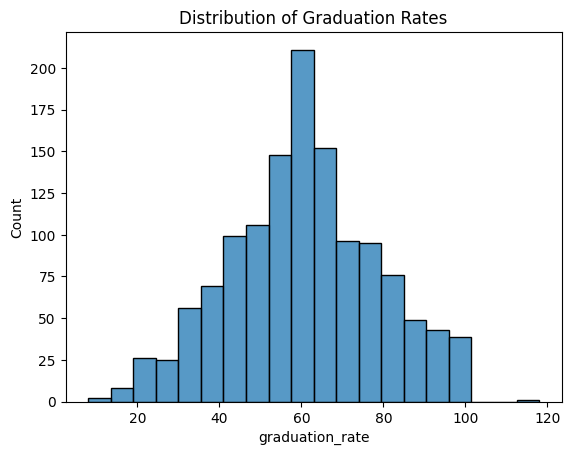 \
**Figure 1.** The distribution of graduation rates plot. The plot indicates the number of universities within each range of graduation rates.

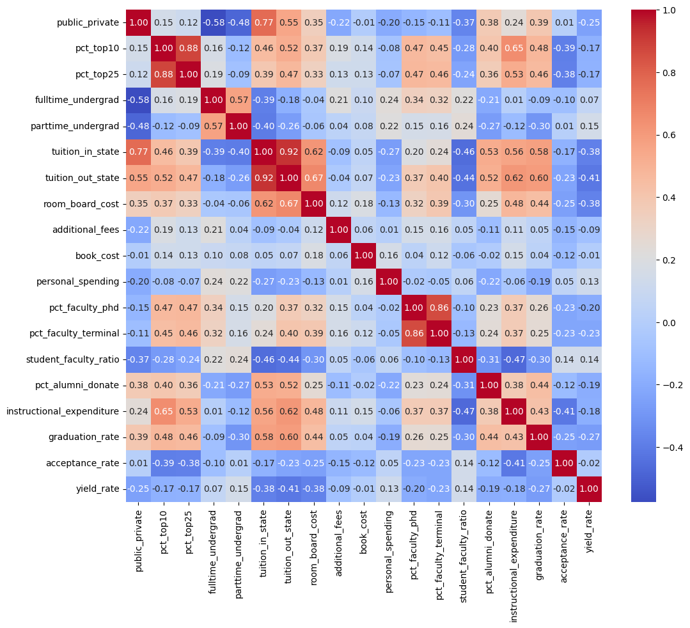 \
**Figure 2.** The correlation heatmap. The heatmap shows the strength of correlation between each features. It is used for feature selection by removing features with strong correlation to reduce multicollinearity. 

# Methodology

## Introduction to Python for Machine Learning

Python was used as the primary programming language for implementing the machine learning pipeline. Key libraries utilized include `pandas` and `numpy` for data manipulation and numerical computation, `matplotlib` and `seaborn` for visualization, and `scikit-learn` for implementing machine learning models and evaluation metrics. These tools provide a flexible and efficient environment for data preprocessing, modeling, and analysis of educational datasets.

## Platform and Machine Configurations Used
<!-- Such Google Colab, Kaggle, Syzygy, or your own machine then the machine configuration. -->

The machine learning workflow was implemented using Python3 within Jupyter Notebooks executed on Google Colab, accessed through Visual Studio Code. For the class-based `.py` files and other scripts, the models were run using the standard Python interpreter. Core libraries included `pandas` and `numpy` for data manipulation, `scikit-learn` for model training and evaluation, and `matplotlib` and `seaborn` for visualization that are included as libraries of Google Colab. This environment allowed efficient data preprocessing, model training, hyperparameter tuning, and generation of plots for model interpretation.

## Data Split
<!-- Data splitting is the process of dividing the data into training, validation, and test sets. This step can help you evaluate the performance of the model on new data. -->

The preprocessed dataset was divided into training and testing sets using an 80/20 split. The training set was used to fit the models and learn the underlying patterns, while the test set was reserved for evaluating the predictive performance of the models on unseen data. This separation ensures that model evaluation reflects the ability to generalize to new institutions rather than simply memorizing the training data.

Due to the size of the dataset, the test set was also used for hyperparameter tuning. Final metrics are reported on this set, and care was taken to avoid overfitting by using relatively simple model configurations.

## Model Planning
<!-- The next step is to select the appropriate machine learning or deep learning models ( 2 - 3 ) that can be used to solve the problem. This involves evaluating different models and selecting the one that is best suited for the problem. -->

Three regression models were selected to predict graduation rates based on institutional characteristics:

- **Linear Regression:** Serves as a baseline model and assumes a linear relationship between features and the target variable.
- **K-Nearest Neighbors (KNN) Regression:** A non-parametric, distance-based model that predicts graduation rates based on the average of the k-nearest institutions in the feature space.
- **Random Forest Regression:** An ensemble tree-based model capable of capturing nonlinear interactions between variables, providing robust predictive performance.

These models were chosen to compare the effectiveness of simple linear models against more flexible non-parametric and ensemble methods.


## Model Training: 
<!-- This involves using the training data to adjust the model parameters to improve its accuracy. -->

Each model was trained using the training dataset. Prior to training, features were standardized using `StandardScaler` to ensure that distance-based calculations for KNN were not biased by differing feature scales. Linear Regression and KNN were trained using the scaled dataset, while Random Forest was trained using the unscaled data since tree-based models are insensitive to feature scale.

The models were fit to the training data to learn the relationship between institutional attributes and graduation rates.

## Model Evaluation
<!-- Once the model is trained, the next step is to evaluate its performance on a validation dataset. -->

Model performance was evaluated on the test set using two regression metrics:

* **Coefficient of Determination (R²):** Measures the proportion of variance in graduation rates explained by the model.
* **Root Mean Squared Error (RMSE):** Provides the average magnitude of prediction errors in the same units as the target variable.

These metrics quantify the accuracy and predictive quality of each model, allowing for direct comparison between different modeling approaches.

## Model Optimization
<!-- Based on the results of the model evaluation, the next step is to optimize the model to improve its performance. This involves making changes to the model's architecture, tuning the hyperparameters, and retraining the model. -->

Hyperparameter tuning was conducted to optimize the performance of KNN and Random Forest models:

* **KNN:** The number of neighbors (`k`) was varied from 1 to 39, and the model with the lowest RMSE on the test set was selected as the optimal configuration.
* **Random Forest:** A grid search over the number of trees (`n_estimators`) and maximum tree depth (`max_depth`) was conducted. The combination yielding the lowest RMSE on the test set was selected.

Linear Regression did not require hyperparameter tuning.


## Final Model Building

<!-- Once the model is optimized, the final step is to fit the model and report final test error for each model

Present the information with support Screen Shots/ Figures (Each Figure must be numbered and Description of Figure must be provided) -->

### Linear Regression

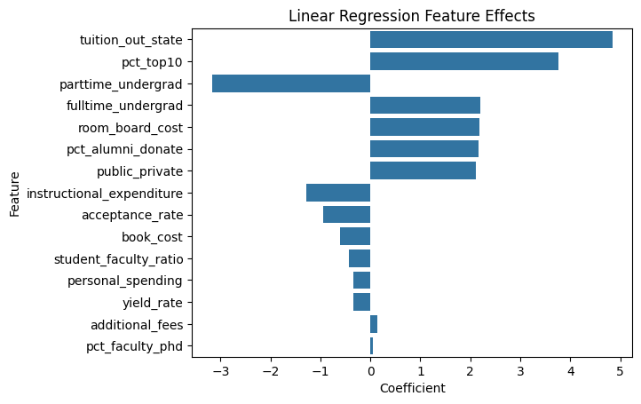 \
**Figure 3.** The feature effect chart for linear regression. The chart indicates the direction and strength of correlation between features and prediction results.

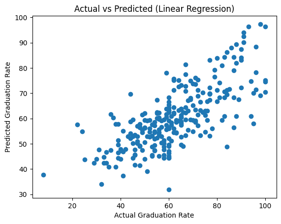 \
**Figure 4.** The actual versus predicted plot for linear regression.

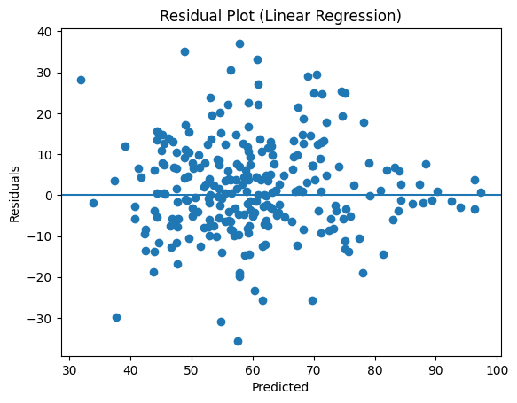 \
**Figure 5.** The residual plot for linear regression.

### KNN

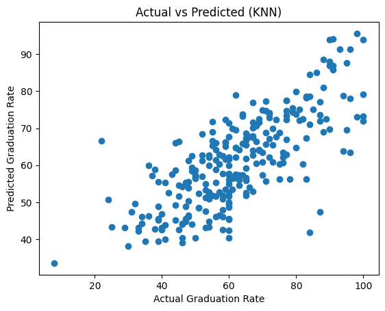 \
**Figure 6.** The actual versus predicted plot for k-nearest-neighbors.

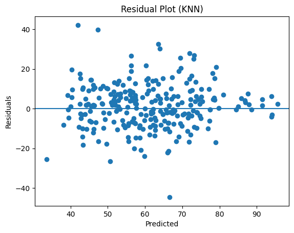 \
**Figure 7.** The residual plot for k-nearest-neighbors.

### Random Forest

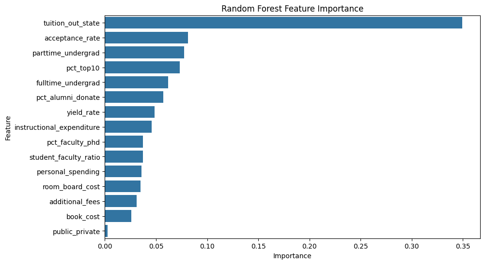 \
**Figure 8.** The feature importance chart for random forest. The chart indicates the strength of each features as the decider of prediction results.

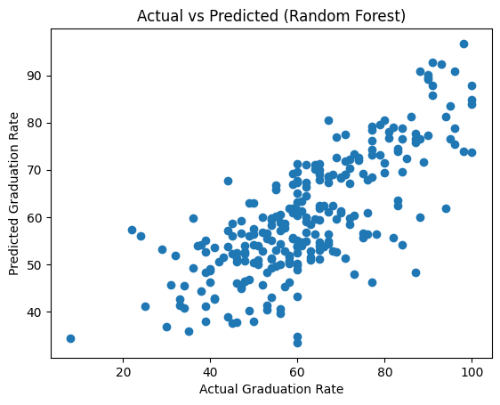 \
**Figure 9.** The actual versus predicted plot for random forest.

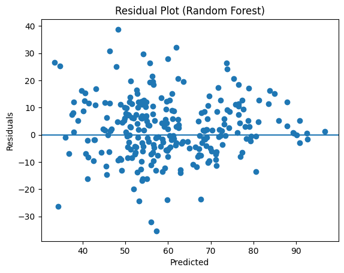 \
**Figure 10.** The residual plot for random forest.


# Results

<!-- 
## Description of the Models
To compare different machine learning models in the results section, here are some steps to consider:

(Overlaps with Model Planning)

## Performance Metrics
Describe the performance metrics used to evaluate the models, such as RMSE, MSE, accuracy, precision, recall, F1 score, or area under the receiver operating characteristic curve (AUC-ROC), etc based on the model class.

(Overlaps with Model Evaluation)
-->

## Results Table
<!-- Create a results table that presents the performance metrics for each model in a clear and concise format. The table should include the name of the model, the performance metric, and the value of the metric. It can also be helpful to include the standard deviation or confidence intervals for each metric. -->

| Model             | R²    | RMSE  |
| ----------------- | ----- | ----- |
| Linear Regression | 0.523 | 11.76 |
| KNN               | 0.555 | 11.35 |
| Random Forest     | 0.561 | 11.28 |

## Interpretation of the Results 
<!-- Provide an interpretation of the results, highlighting any significant differences between the models. Discuss which model performed the best and why, as well as any limitations or potential sources of error. -->

The results indicate that Random Forest Regression achieved the best overall performance, with the highest R² value and the lowest RMSE. KNN Regression also performed well, slightly outperforming Linear Regression. However, the differences between the models are relatively small, suggesting the underlying relationships between features and graduation rate may be largely linear, and more complex models provide only marginal benefit.

The R² values, all around 0.52 to 0.56, indicate that approximately half of the variance in graduation rates can be explained by the features in the dataset. This suggests that other unobserved factors may also play a significant role in determining graduation outcomes. Additionally, the RMSE values, which are around 11, indicate that predictions typically deviate from actual values by approximately 11 percentage points.

Overall, ensemble methods such as Random Forest provide slight improvements due to their ability to model nonlinear relationships, while simpler models still capture a substantial portion of the underlying patterns in the data.

## Visualization
<!-- Provide visualizations to support the interpretation of the results, such as bar charts or box plots. These can help to illustrate the differences between the models and make the results more accessible to readers. -->

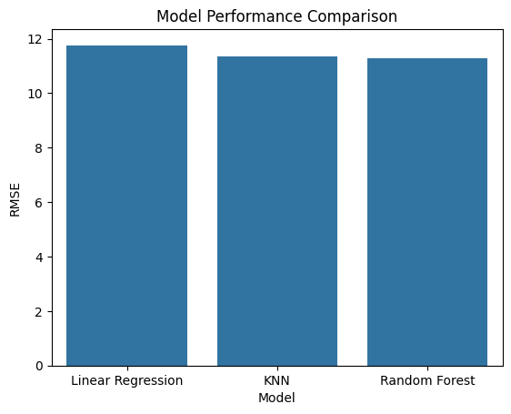 \
**Figure 11.** The model performance comparison barchart for the root mean squared error of each model prediction. The chart indicates a subtle difference between each model. 

## Sensitivity Analysis
<!-- Conduct a sensitivity analysis to test the robustness of the models. This can involve varying the parameters or features used in the models and re-evaluating their performance. -->

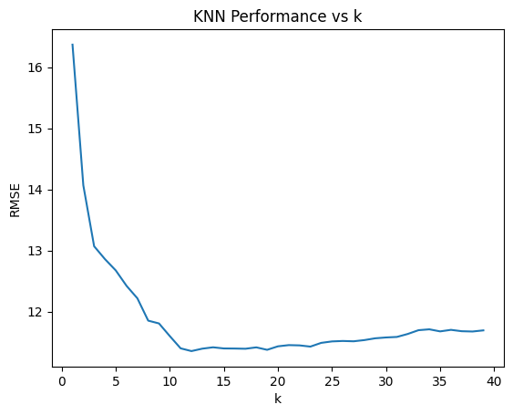 \
**Figure 12.** The KNN performance versus k (neighbors) graph used for hyperparameter tuning. The graph indicates the least root mean squared error at around k=12.

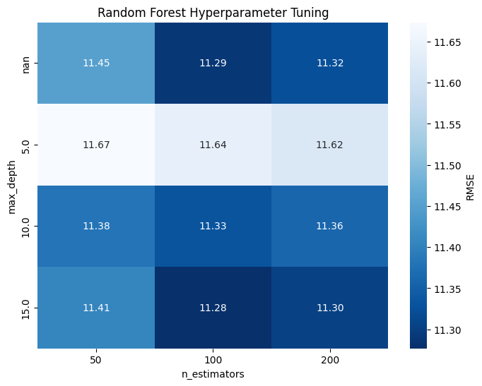 \
**Figure 13.** The random forest hyperparameter tuning heatmap. The axis represent the 2 parameter used for tuning, where the darker the blue, the lower the RMSE. 

# Conclusion
<!-- Conclude by summarizing the key findings of the analysis, discussing the implications of the results, and suggesting areas for future research. -->

The goal of this project is to use machine learning techniques to better understand the factors that influence university graduation rates and to evaluate whether these factors can be used to make reliable predictions. By applying data preprocessing, exploratory analysis, and regression modeling, the project aims to both uncover meaningful relationships in the data and assess the effectiveness of different predictive approaches.

This project applies multiple machine learning models to predict graduation rates using institutional data. Linear Regression, K-Nearest Neighbors, and Random Forest models are developed and evaluated using R² and RMSE metrics. Among the models, Random Forest achieved the best performance, although the improvement over the other models was relatively small. The results indicate that while the selected features are useful in explaining graduation rates, a significant portion of the variance remains unaccounted for, suggesting the influence of other external factors.

Future work could explore incorporating additional features, such as socioeconomic or demographic data, as well as experimenting with more advanced models and feature engineering techniques to improve predictive performance.


# References
<!-- ::: {#refs}
::: -->

<!-- ```bib
@misc{cmu_college_1995,
  author = {{Carnegie Mellon University}},
  title = {U.S. News College Data (1995)},
  year = {1995},
  url = {http://lib.stat.cmu.edu/datasets/colleges/usnews.data},
  note = {Accessed: 2026-03-14}
}
``` -->

(1995) CMU. Available at: http://lib.stat.cmu.edu/datasets/colleges/usnews.data (Accessed: 14 March 2026).