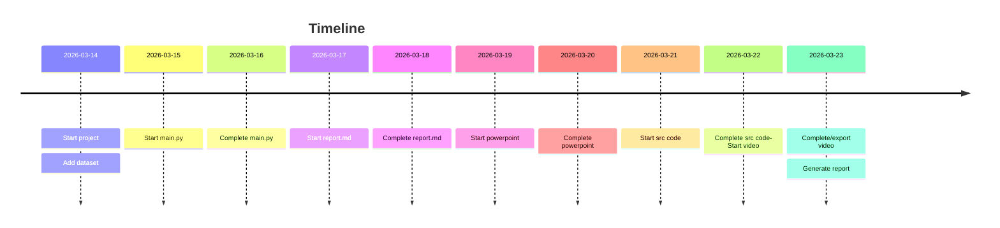

# Timeline

**2026-03-14**
<!-- - Requirements
- Design
- Analysis
- Implementation
- Test -->
- Analyse project requirements
- Initialize report doc
- Initialie ppt
- Add dataset
- Setup pm logistics

**2026-03-15**
- Write abstract
- Start main.py

**2026-03-16**
- Complete main.py
- Start report.md

**2026-03-17**
- Continue report.md

**2026-03-18**
- Complete report.md

**2026-03-19**
- Start powerpoint

**2026-03-20**
- Complete powerpoint

**2026-03-21**
- Start src code

**2026-03-22**
- Complete src code
- Start video

**2026-03-23**
- Complete/export video
- Generate report