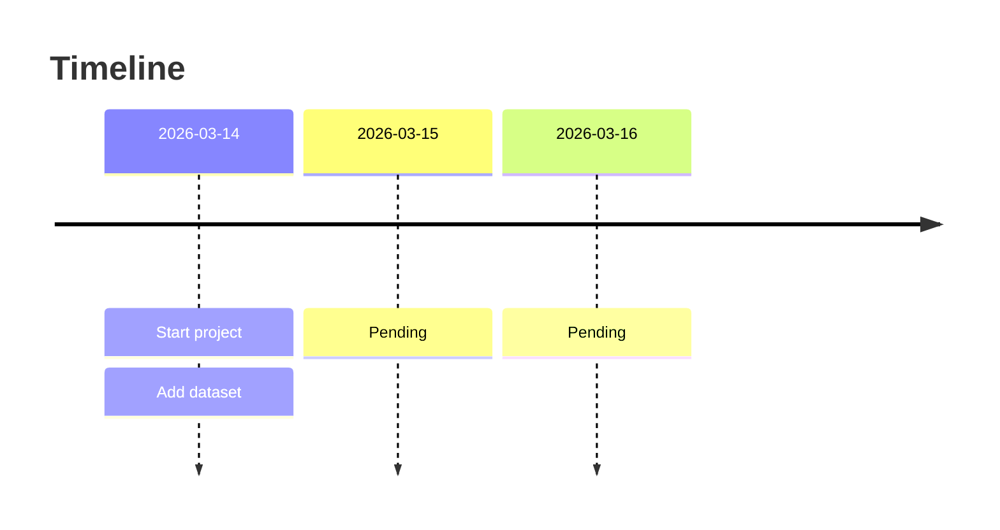

# Timeline

**2026-03-14**
<!-- - Requirements
- Design
- Analysis
- Implementation
- Test -->
- Analyse project requirements
- Initialize report doc
- Initialie ppt
- Add dataset
- Setup pm logistics

Next Step
- Write abstract
- Start code

**2026-03-15**
- pending

Next Step
- pending